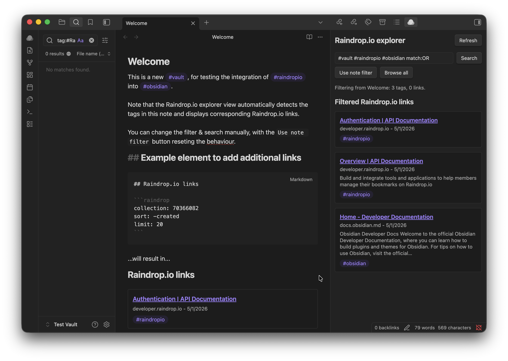

# Raindrop.io Plugin for Obsidian

Raindrop.io Plugin for Obsidian shows saved Raindrop.io bookmarks inside notes and in a note-aware explorer side pane.

The plugin uses a Raindrop.io access token and the official Raindrop.io REST API. OAuth is planned for a later release.



## Features

- **Raindrop.io explorer**: Browse saved bookmarks from the configured collection in a side pane.
- **Note-aware filtering**: Let the explorer follow the active note by turning note tags and external links into a Raindrop.io search query.
- **Manual search**: Search Raindrop.io directly with keywords, `#tag` filters, exact phrases, or operators such as `type:article`, `notag:true`, and `created:2024-01`.
- **Note blocks**: Render saved Raindrop.io links inline from fenced `raindrop` code blocks.
- **Configurable tag clicks**: Choose whether tags on rendered Raindrop.io items search Obsidian notes, filter the explorer, or do nothing.
- **Native Obsidian UI**: Uses Obsidian commands, a ribbon icon, theme-friendly styling, and no hidden telemetry.

## Setup

1. Create or copy a Raindrop.io access token.
2. Open **Settings -> Community plugins -> Raindrop.io Plugin for Obsidian**.
3. Paste the token into **Access token**.
4. Use **Open explorer** from the command palette or ribbon icon.
5. Optionally add a `raindrop` block to a note for inline results.

The access token is stored in Obsidian plugin data and sent only to the Raindrop.io REST API.

## Explorer

The side pane opens as **Raindrop.io explorer**. It can browse all saved links from the configured collection, run manual searches, and load more paginated results.

Controls:

- **Search**: Runs the query in the search field against Raindrop.io.
- **Use note filter**: Rebuilds the query from the active markdown note.
- **Browse all**: Clears the query and shows the configured collection.
- **Refresh**: Reloads the current explorer state.
- **Load more**: Requests the next page of results when more are available.

When the explorer follows a note, it uses:

- Obsidian tags from the active note as Raindrop.io tag filters, for example `#project`.
- External `http` and `https` links as exact phrase searches.
- `match:OR` when multiple note-derived filters are present, so a bookmark can match any note tag or link.

Opening and interacting with the explorer preserves the last active markdown note as context, so the note filter remains stable while you browse.

## Note blocks

Add a fenced code block to any note:

````markdown
```raindrop
collection: 0
tag: project-x
search: important
sort: -created
limit: 20
```
````

Options:

- `collection`: Raindrop.io collection ID. Use `0` for all collections. Defaults to **Default collection**.
- `tag`: Raindrop.io tag to include in the search. Multi-word tags are quoted automatically, for example `#"coffee beans"`.
- `search`: Raindrop.io search query. This is passed through to Raindrop.io.
- `sort`: Raindrop.io sort value, for example `-created`. Defaults to **Default sort**.
- `limit`: Number of links to request, clamped between 1 and 100. Defaults to **Default limit**.

You can combine `tag` and `search`; the plugin joins them into one Raindrop.io query.

## Settings

- **Access token**: Token used for Raindrop.io API requests.
- **Default collection**: Collection ID used by the explorer and note blocks unless a block overrides it. Use `0` for all collections.
- **Default limit**: Number of links requested per page or block render. Values are clamped between 1 and 100.
- **Default sort**: Sort value passed to Raindrop.io, such as `-created`.
- **Tag click behavior**: Controls clicks on tags shown on Raindrop.io items.

Tag click behavior options:

- **Search notes for the tag**: Opens Obsidian search for the clicked tag.
- **Filter explorer by the tag**: Opens the explorer and applies the clicked tag as a Raindrop.io filter.
- **Do nothing**: Leaves tag clicks inactive.

## Commands

- **Open explorer**: Opens the Raindrop.io explorer side pane.
- **Refresh explorer**: Reloads open explorer panes.

## Search syntax

The plugin passes search text through to Raindrop.io. Useful examples:

- `#project-x`: Bookmarks tagged `project-x`.
- `#"coffee beans"`: Bookmarks with a multi-word tag.
- `"exact phrase"`: Exact phrase match.
- `type:article`: Article bookmarks.
- `notag:true`: Bookmarks without tags.
- `created:2024-01`: Bookmarks created in January 2024.
- `#work #research match:OR`: Bookmarks matching either tag.

## Privacy and network access

- The plugin only makes network requests to `https://api.raindrop.io`.
- The access token is stored locally in Obsidian plugin data.
- Note-aware filtering sends the generated Raindrop.io search query to Raindrop.io. If the active note contains external links, those URLs can be included in the query.
- The plugin does not collect analytics or use hidden telemetry.

## Release files

Obsidian release assets are built at the repository root:

- `main.js`
- `manifest.json`
- `styles.css`

Do not commit generated `main.js`; attach it to GitHub releases together with `manifest.json` and `styles.css`.

## Development

Install dependencies and build the plugin:

```bash
npm install
npm run build
```

For watch mode:

```bash
npm run dev
```

Quality checks:

```bash
npm run lint
```

## License

Copyright (C) 2026 Lukas '@dotWee' Wolfsteiner <lukas@wolfsteiner.media>

Licensed under the _[DO WHAT THE FUCK YOU WANT TO BUT IT'S NOT MY FAULT PUBLIC LICENSE](LICENSE)_.
